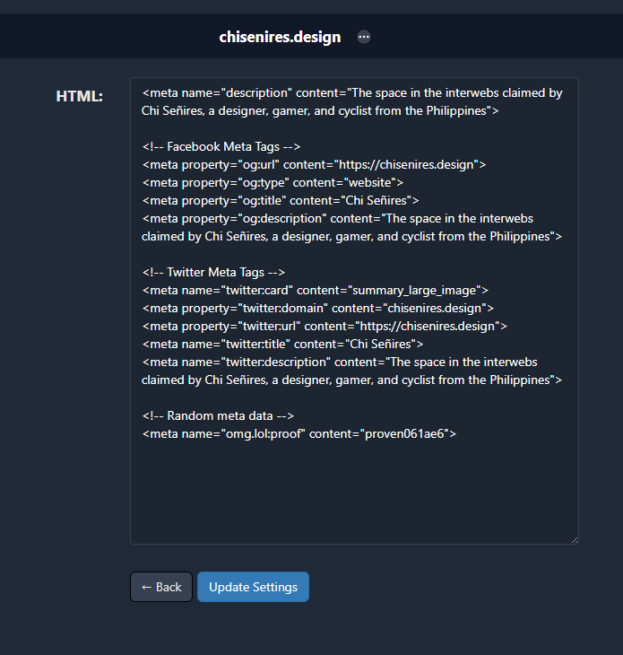

---
bluesky:
  id: bafyreib23xeywx5oc4mqktxywf2mfqgq6rfb4gm7ptjitgbw3l76ag6fv4
  url: 'at://did:plc:f4mmql45u3lfj6iltwjvtcdk/app.bsky.feed.post/3jzmyqf2iur2f'
  link: 'https://bsky.app/profile/did:plc:f4mmql45u3lfj6iltwjvtcdk/post/3jzmyqf2iur2f'
  handle: chiawase.bsky.social
  hostname: bsky.social
  did: 'did:plc:f4mmql45u3lfj6iltwjvtcdk'
date: 2023-07-04T00:33:43+0800
images:
  - https://cdn.uploads.micro.blog/113466/2023/image-2023-07-04-002850438.png
  - https://cdn.uploads.micro.blog/113466/2023/image-2023-07-04-002859016.png
mastodon:
  id: 110651099364396421
  username: chi
  hostname: social.lol
photos: 
photos_with_metadata: 
url: /2023/07/04/yay-my-metatags.html
---

Yay my metatags work 😁 Got to use the Metatags Plug-in by [@manton](https://micro.blog/manton) and just tested it out. Woohoo 🥳

