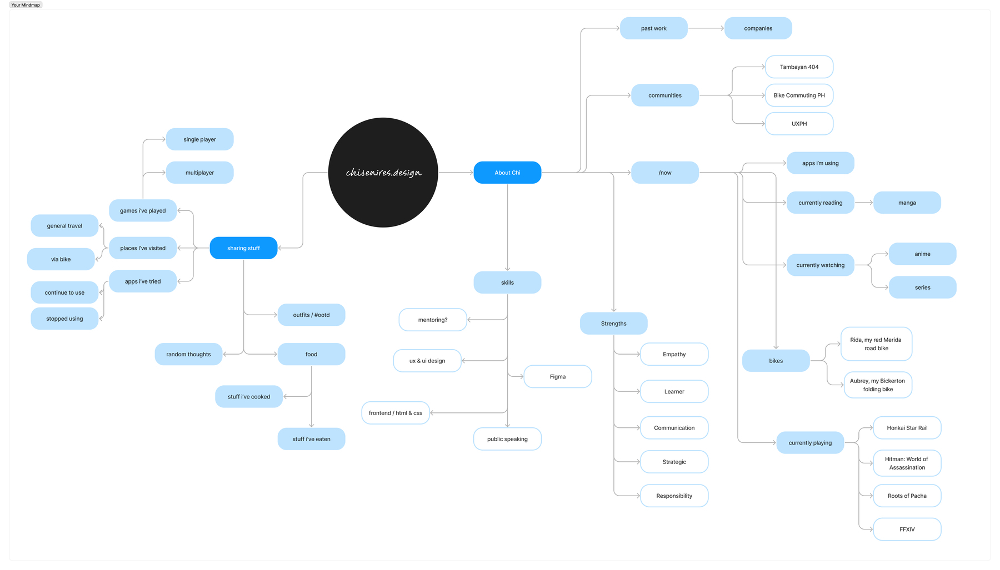

I made a [quick mind map on FigJam]( https://www.figma.com/file/APwhoYyk6Gogu71PtS1jcs/Chi's-micro.blog?type=whiteboard&node-id=1%3A677&t=w4N3fPT274qRfvkG-1) on how I wanna organize _stuff_ here in general. IDK if this works, but I guess it's a start?

