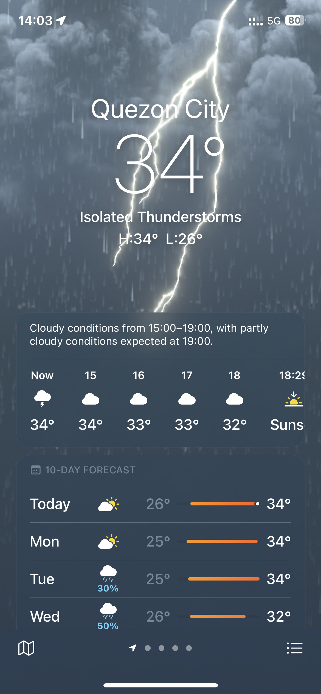

---
bluesky:
  id: bafyreid5pmbyhzdyg7i7mex5p5txhn2lhow6scvf2r57uzbyp6g3ixfyjq
  url: 'at://did:plc:f4mmql45u3lfj6iltwjvtcdk/app.bsky.feed.post/3k22zbkl6eg22'
  link: 'https://bsky.app/profile/did:plc:f4mmql45u3lfj6iltwjvtcdk/post/3k22zbkl6eg22'
  handle: chiawase.bsky.social
  hostname: bsky.social
  did: 'did:plc:f4mmql45u3lfj6iltwjvtcdk'
date: 2023-07-09T14:16:01+0800
images:
  - https://cdn.uploads.micro.blog/113466/2023/72158b04fc.jpg
mastodon:
  id: 110682661850873560
  username: chi
  hostname: social.lol
photos:
  - https://cdn.uploads.micro.blog/113466/2023/72158b04fc.jpg
photos_with_metadata:
- url: https://cdn.uploads.micro.blog/113466/2023/72158b04fc.jpg
  width: 1170
  height: 2532
url: /2023/07/09/my-god-this.html
---

my god this temp, 34°C???? 🥵 umabot na tayo sa peak nung inet, ulan mode na

