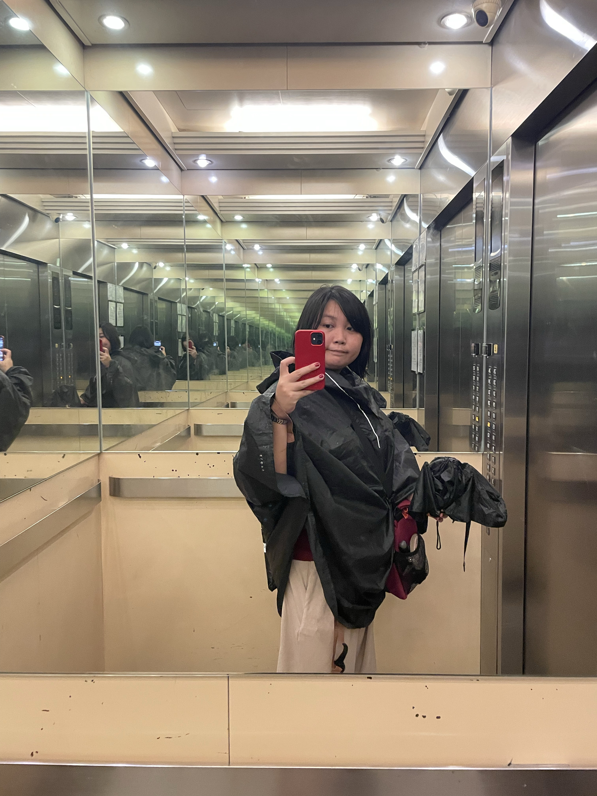

lakad + tao mode today because I hauled a box of empty glass bottles from our house this morning to work for our office's donation drive. I couldn't figure out yet how I'd bring both my foldie and the box of bottles by myself 🫠 so I was at the mercy of traffic and rain today.

Thankfully pwede ako makisabay sa officemate's Grab that was going the same direction, bumaba ako somewhere along the way and walked na lang para malapit na lang 😆

Poncho mode pa rin since I still brought my bike bag 😁

