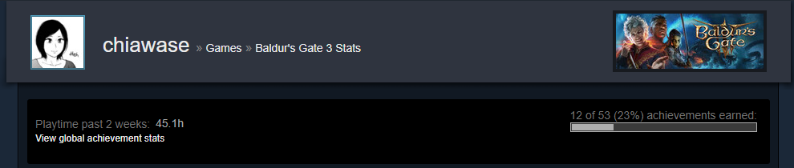
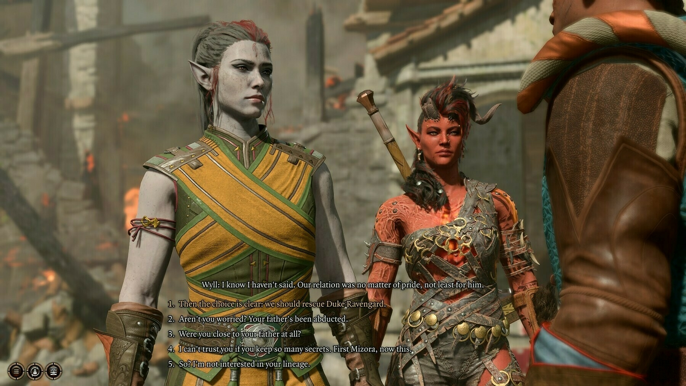
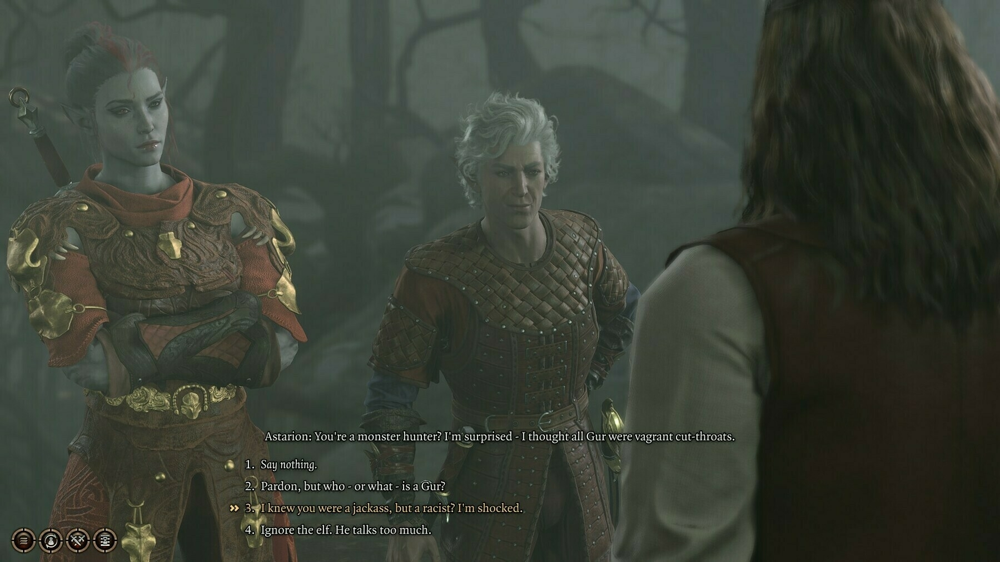
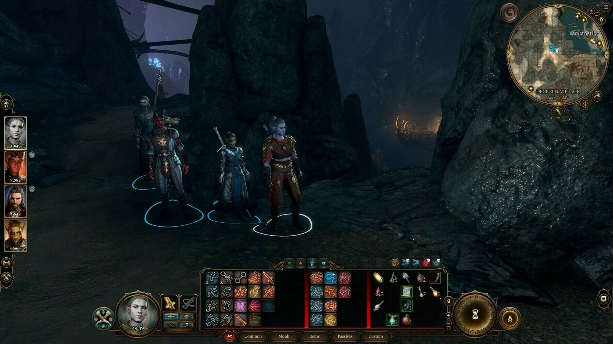

The last week has been spent playing [Baldur's Gate](https://store.steampowered.com/app/1086940/Baldurs_Gate_3/) almost every time I get a chance to, which just shows in my total number of hours so far...

If you're wondering why I haven't been posting much, it's because I am deep, deep into this game and I am not yet sick of it. 😆

<!--more-->

## First thoughts & relating it to IRL DND

I initially didn't know about the game until my boyfriend told me about it. He kept selling the idea of it to me, initially with the prospect of being able to play DND in a PC game. Specifically, DND 5th edition. I had no idea what the latter meant, but I found out after asking that it was the specific edition I got to try out in person when we played 1 round with some friends a few years back.

I remember feeling overwhelmed even before we got to meet in person, with all the character creation needs and the pressure of thinking about a backstory for my character (who I'm supposed to be roleplaying?). I don't remember much of the races then, and didn't feel any particular appeal to any single one, though I knew I didn't just want to be a human. After all, if other fantasy races were available, I might as well try one of them. As for classes, I really avoided having anything to do with classes that had lots of spells, and wanted to rely on my character's base stats instead, because having to remember a slew of spells that you had in your arsenal felt daunting. What if I forgot that I had a spell that would've been useful for that particular moment in our playthrough? What if I misunderstood how the spell worked? I didn't want to make mistakes, so I figured I should just make things simple for me.

I forget what class and race I tried back then in IRL DND, and I don't even remember the backstory I set up for them. All I know was I felt a bit awkward at first going into it, and that was that.

## Getting Baldur's Gate 3 and creating my character

A few videos covering the basics and mechanics of Baldur's Gate 3 eventually convinced me to buy the game (courtesy of my boyfriend egging me that we could also play together, of course. LDR moments 🥲).

My first playthrough was a multiplayer party setup with my boyfriend. He waited for me to get through my character creation setup, and as I got into the details of it, the same feeling of being overwhelmed came back, but so was some curiosity. Eventually the latter trumped the former, since I had the help of game graphics to help visualize what these elusive races and classes looked like. Now I definitely knew I didn't want to be just some human, though I also knew I didn't want to be a dragonborn or any of the dwarves, gnomes, halfings (aesthetics-wise).

That left the githyanki, the elves, the tieflings, and the drow. The githyanki looked interesting, but they were still too foreign to me as someone new to DND. As for elves, I associate them with spells and magic, and that was something I also didn't necessarily want to get myself into just yet. I ended up with a big-bodied female drow who was a Monk. It was time to punch things!

If ever you're wondering why I went with the Monk class: in FFXIV, [my character](https://na.finalfantasyxiv.com/lodestone/character/36591732)'s main class was also a Monk, for the same reason: I didn't want to overcomplicate my gaming experience with knowing spells and such. I just wanted to know how to attack, defend, and maybe do a bunch of other things, but keeping it simple still.

Going back to BG3, I had fun with the character creation for this. While the types of eyes are something I wished there were more variations of, I loved the customization for the hair, eye color/s, voice. I also wished there were ways to adjust the body types available, but I guess they set it up to either average-sized or bigger-sized to keep things simple (given there were already a slew of other customizations available).

### Figuring out the gameplay as I went

The first playthrough was a bit challenging, because of the following things:

1. I was still figuring out the controls on how to act and such, especially in the turn-based combat.
2. My boyfriend and I sometimes clashed in the things we wanted to do: who to attack, where to go, how to maximize our actions, etc.
3. We also tried to keep up with the dialogue of each other's characters with other NPCs, instead of exploring on our own and just telling the other about it afterwards.

I felt a bit awkward after our first round of playing. I was worried I might have wasted money in buying something I might not feel inclined to play (since that's what it felt at the time; I was too overwhelmed with all the decisions I had to make and the consequences felt too dire at the time). But I figured maybe I just needed to try again, take my time in figuring it out. My boyfriend also acknowledged that, especially when I voiced out that I might not get everything immediately.

On our second round of playing, we kind of eased into each other's playing style. I also was now having fun with the dialogue with some of the characters available, as we kept meeting some when we were exploring.

I felt a bit scared when I had to control one of the playable characters and make them part of my party because that meant I was _responsible_ for them. Initially, I just took the back seat and just waited for my boyfriend to call the shots for our playthrough, while having the thought of practicing all of this in a separate solo playthrough once we're finished. Once we figured out that there was an option in the game to group your characters together and have them go to the same places, things got easier in terms of moving.

Our cooperation in the turn-based combat also improved because we both would talk first about what we were planning to do, plus we took the time to read the descriptions of the actions that were available in our character's toolbars. Since I was a monk, my strength was more on melee attacks or in doing sleight-of-hand stuff (since my Dexterity was high). My boyfriend's character in our playthrough is a Warlock, so he had the Eldtrich blast, among other spells.

Figuring out where each other's strengths and weaknesses were improved how we approached things. If we'd benefit to do something with an Intelligence check, he'd do it with his Warlock; if it was something that required Dexterity, it'd be my character instead. All-in-all, we got to iron out the kinks and we got to progress a good bunch into the adventure.

## Setting up my own solo playthrough

Since me and my boyfriend are in different timezones, there are times when he'd either still be asleep or would be busy during the times I was awake and able to play. I figured I'd start my own playthrough so I can also figure out more of the game's quirks, as well as possibly try the conversations that his character went through (and I had to just watch as a spectator) and see if there would be any difference.

For simplicity's sake, I kept the same race and class: another big-bodied drow Monk. I just changed the hair and voice a bit, and the name too. I also set my difficulty to the easiest one, since I didn't plan on going into combat a lot anyway. I was thinking I could be a good-natured character, who was sometimes stern as Monks are. Or something.

I eventually learned that the fact that I was a drow was enough to get almost all the early NPCs to have a different reaction when I'd talk to them. It was borderline racist in an amusing way. Just because I was a drow, these character's reactions to me are like, "wait why are you helping me? Aren't you supposed to be evil?" and every time I had to question if I wanted to stay in _my_ character setup (which was a sometimes good-natured person who just wanted to help) or roleplay based on my choices of race and class (for Monk, it was fairly easy to play along with the choices; for drow-related ones... sometimes they're not my first pick. 😅) I was amused with how dumbfounded some characters were with me trying to help them.

Eventually, I got to figure out how to play the other playable characters, too. I enjoyed playing around with the Rogue character, since if I weren't a Monk, I would've chosen a Rogue to play; I eventually appreciated Clerics, Wizards, and Warlocks; and I thoroughly enjoyed beating shit up with the tank-build Fighters and Barbarians. They all also got their own quirks and strengths, so as the game progressed, I figured out who was strong with which action, for example in persuading people to do stuff or in charming people that you're innocent (even if the truth is otherwise).

## Sharing some screenshots of my game (and possibly some minor spoilers)

I only have a few screenshots of the game, because I've found myself super engrossed in the gameplay that I forget to do this.

Also be warned, if you don't wanna spoil your gameplay or story, just skip this part entirely. This is the last bit to my ramblings about the game anyway.

Overall: fun game. Takes some warming up to the controls and mechanics, but with some guidance one can eventually get it and explore and act to their heart's content. Also: sometimes games where choices have consequences are intimidating, but eventually one can have fun with it as long as you remember that you can always just try again next time.

Alright, with that out of the way, here are a few snippets from my game:

### A preview of what my character looks like in my solo playthrough

I tried to commit to being a drow as much as possible, so that meant the gray-ish skin, and gray hair. I added some red highlights to her hair though, since I really love red. Her eyes are also of different colors: her right eye is red and her left eye is gray dark. Purely for aesthetic reasons. (Though for my character in the playthrough with my boyfriend, the colors' placements are swapped. For funsies. hehe)

### Some funny dialogue responses to what a party member said to an NPC

While exploring the Sword's Coast (the name of the place according to some characters), we bumped into this person who is apparently a Gur (?). Astarion's reaction was intriguing, calling all Gurs cut-throats, but I laughed out loud IRL when I saw this response: "I knew you were a jackass, but a racist? I'm shocked." I ended up choosing the clarification on who a Gur is, but if ever I encounter this in my playthrough with my boyfriend, I might end up choosing this option instead 😛 Our solo playthroughs are our serious playthroughs. The one where we coop is turning out to be a "fuck around and find out" kind of playthrough. 😆

### A preview of my 4-member party in some dark depths

Here, I'm exploring some dark depths with my full party. As you may have noticed, Karlach is also here again; as much as possible, I wanna keep her by my character's side as much as possible because I love her wholesome and cute personality to bits, despite how she looks. She's also really powerful, so I'm not just keeping her around just because I'm fond of her.

And there's that. If you got this far into my ramblings, thank you! I didn't have a clear outline of this, and just wrote what I thought was interesting.

I might end up not posting much too given that I'm still really deep into just finishing Act 1 of this game. I thought I finished it already, but apparently, I'm still only halfway through it. Here's to getting to Act 2!
