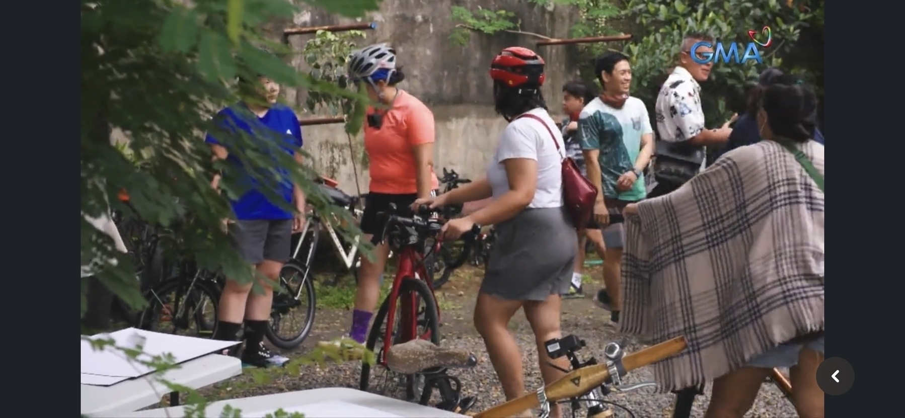

Just wanted to share that I was on GMA's I-Witness for a few seconds 😆 during one of the rides I joined to go to Pasig River, apparently sir Howie was tagging along wahaha

You can watch the documentary on YouTube:

import { YouTube } from "astro-embed";

<YouTube id="https://www.youtube.com/live/cY0hfpCPtRs" />

We show up at the near end hehe

I hope the I-Witness documentary covering Pasig River provides people some insight on what the (negative) effects of PAREX could be if the expressway project finishes (since it has some movement but as since stopped? for now??), and I hope it also gets more people to consider how we might make Pasig River be more alive, clean, and benefit the people 😊 #IlogPasiglahin, ika nga hehe

