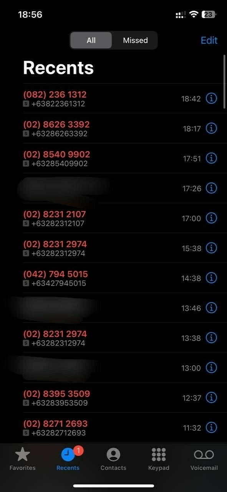

---
bluesky:
  id: bafyreia5wen4kzbvijipbmgb4inui6dgzkxfaaicocafvbi52gl6ndhsb4
  url: 'at://did:plc:f4mmql45u3lfj6iltwjvtcdk/app.bsky.feed.post/3k6ktrh4izb25'
  link: 'https://bsky.app/profile/did:plc:f4mmql45u3lfj6iltwjvtcdk/post/3k6ktrh4izb25'
  handle: chiawase.bsky.social
  hostname: bsky.social
  did: 'did:plc:f4mmql45u3lfj6iltwjvtcdk'
date: 2023-09-04T19:00:52+0800
images:
  - https://cdn.uploads.micro.blog/113466/2023/6607b0088b6d4ee29369dca2ead971db.jpg
mastodon:
  id: 111006534190123230
  username: chi
  hostname: social.lol
photos:
  - https://cdn.uploads.micro.blog/113466/2023/6607b0088b6d4ee29369dca2ead971db.jpg
photos_with_metadata:
- url: https://cdn.uploads.micro.blog/113466/2023/6607b0088b6d4ee29369dca2ead971db.jpg
  width: 277
  height: 600
url: /2023/09/04/these-were-all.html
---

these were all just from today. My goodness. Who are all these numbers and why do y'all keep calling??

Does this also happen to people in other countries? Is this just a PH thing? 😵‍💫

