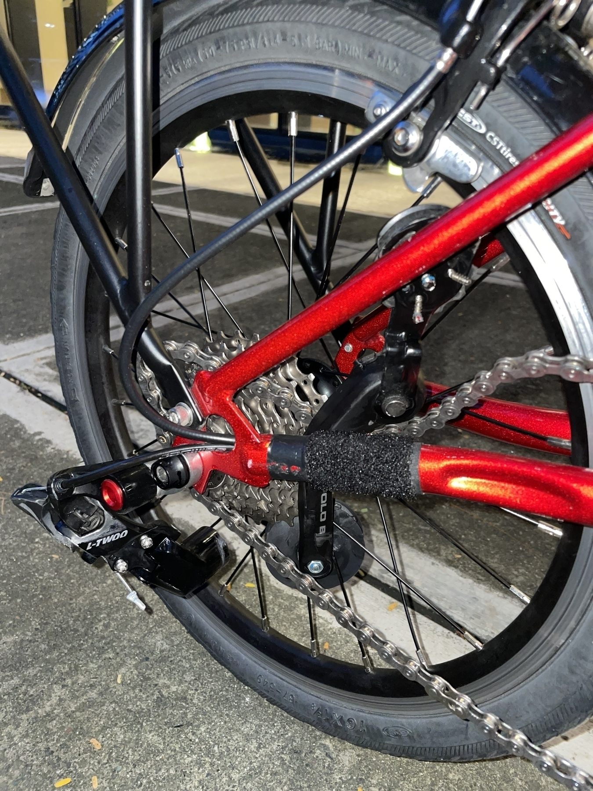

I wanted to super celebrate World Car-Free Day today by doing my bike commutes to and from work, as usual. Even with the looming smog that was covering Metro Manila, which initially was suspected to be from the Taal Volcano down south but [apparently is most likely from motor vehicle emissions](https://newsinfo.inquirer.net/1835387/smog-in-metro-manila-not-from-taal-phivolcs-denr), I wanted to still keep up the notion that biking is and should be something more people do.

Yet today will not go as planned.

<!--more-->

My ride to work was normal; I even had my GoPro on my neck mount and recorded some near hits by motor vehicles just... blatantly disregarding personal space on the road. Other than that, it was a typical working day for me.

I went home at around 6PM when our shift usually ends, and rush hour in the city where I work usually worsens. Especially so on a Friday night. Regardless, I wanted to persevere.

I said goodbye to another teammate who was also leaving around the same time as me and headed down from our office. I went my usual way, getting my stuff ready for my bike commute, and unfolded my bike, and got ready to pass the traffic (thank you, bike lanes!).

But, as I tried to pedal, the shifting seemed to get stuck. I was thinking maybe it just wasn't set to the right gear, so I adjusted that on my bike and then kept trying. I think because of that... the chain tensioner* (?) of my folding bike's rear derailleur broke.

*side note: I just got this term from a friend online when I shared what happened. I just knew something broke on my rear derailleur. I didn't know what part. But that seems to be the name. 😅

I immediately knew I couldn't ride home on my bike, even if I did consider for a second turning my bike into a single-speed one so at least I could just bring it home... But I didn't know how to do that. 

The next thing I remembered was my teammate who I said goodbye to earlier. I immediately texted them to ask if they'd gone home already since we're also neighbors. They said that they were still just waiting for their Grab (a ride-sharing service in SEA). I asked if I could hitch a ride with them, and they said sure. So I was really lucky I got to come with them, otherwise, I might have waited outside my office for maybe an hour or so, just waiting to get a ride-share booking. That's how it usually is on Friday nights around my office.

As we got in the car and headed to their home, I was cringing inside a bit as we rode through the traffic along EDSA. It really is worse now than it was before. Not necessarily because of the number of lanes taken up by traffic; that's usually a default during rush hour. The problem is that rush hour now has a longer time period, which means there really are more motor vehicles on the road. And they're all just trying to go home.

We eventually got to the drop-off point, and I thanked my teammate for letting me ride with them back to our city. It was just around 5km away, and I think it took us around 30 minutes? Maybe? To get back? I don't think I took note of the time.

I made my way to the side of the road, and one of the guards from the condominium where my teammate lives saw me rolling my folded bike. They saw my loose chain and asked, "Broken chain?" I just initially said yes since I didn't think it was important to explain that it wasn't the chain that broke, but the tensioner*.

The guard then helped me hail a tricycle so I could go home. Thankfully the driver also seemed friendly;  I shared with him what happened as we made our way back to where I lived, which was around 1-2km away.

I eventually got home around an hour after I left the office. I recognize how lucky I was to hitch a ride back. Technically though, had I ridden my foldie home, I would have rested earlier. 😅

But all's well that ends well. I'm home safe, I had a mask on while I was out because of the smog, and now I'm at my desk writing this down.

I guess now I have a reason to use my road bike again. Up until I get my folding bike fixed, at least. I already got to contact the bike shop where I initially bought my foldie, and they already gave me a quotation for the replacement of the rear derailleur and all.

Happy World Car-Free Day, everyone. I hope we eventually get to a point where emissions from motorized vehicles don't endanger our lives within urban areas.
