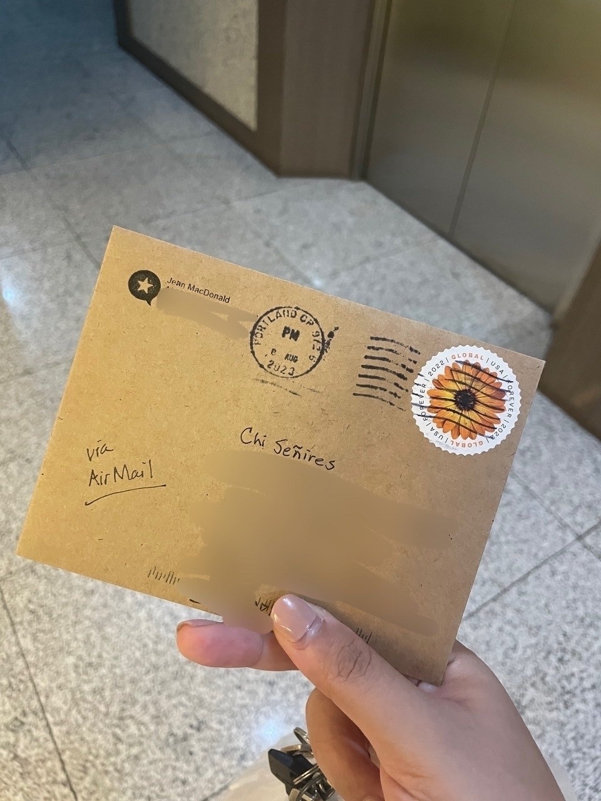
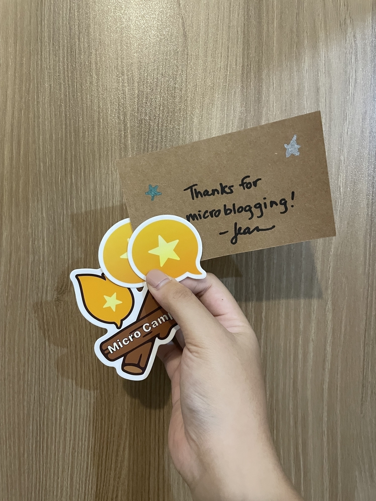

---
bluesky:
  id: bafyreihyalmxtliay3zx7ufwk2mhqukcmf7t3zqppk5u2ynrbuzhiah5cm
  url: 'at://did:plc:f4mmql45u3lfj6iltwjvtcdk/app.bsky.feed.post/3kagfr2pphv2s'
  link: 'https://bsky.app/profile/did:plc:f4mmql45u3lfj6iltwjvtcdk/post/3kagfr2pphv2s'
  handle: chiawase.bsky.social
  hostname: bsky.social
  did: 'did:plc:f4mmql45u3lfj6iltwjvtcdk'
date: 2023-09-28T11:30:21+0800
images:
  - https://cdn.uploads.micro.blog/113466/2023/71a9e0ff9b.jpg
  - https://cdn.uploads.micro.blog/113466/2023/b2b6ff1d09.jpg
mastodon:
  id: 111140656110118497
  username: chi
  hostname: social.lol
photos:
  - https://cdn.uploads.micro.blog/113466/2023/71a9e0ff9b.jpg
  - https://cdn.uploads.micro.blog/113466/2023/b2b6ff1d09.jpg
photos_with_metadata:
- url: https://cdn.uploads.micro.blog/113466/2023/b2b6ff1d09.jpg
  width: 450
  height: 600
- url: https://cdn.uploads.micro.blog/113466/2023/71a9e0ff9b.jpg
  width: 450
  height: 600
url: /2023/09/28/look-what-finally.html
---

look what finally arrived! 😆 thanks for these stickers, [@jean](https://micro.blog/jean)! 😊

