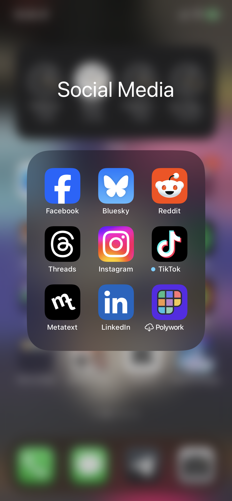

---
bluesky:
  id: bafyreihuzk576lcfdppl5svch66prkmacfoxyu2bn25n6frne6sj6yuabi
  url: 'at://did:plc:f4mmql45u3lfj6iltwjvtcdk/app.bsky.feed.post/3kh6jbtnzgo2j'
  link: 'https://bsky.app/profile/did:plc:f4mmql45u3lfj6iltwjvtcdk/post/3kh6jbtnzgo2j'
  handle: chiawase.bsky.social
  hostname: bsky.social
  did: 'did:plc:f4mmql45u3lfj6iltwjvtcdk'
date: 2023-12-23T10:08:16+0800
images:
  - https://cdn.uploads.micro.blog/113466/2023/5a56f87db4.png
mastodon:
  id: 111627292953874318
  username: chi
  hostname: social.lol
photos: 
photos_with_metadata: 
url: /2023/12/23/oooh-bluesky-became.html
---

oooh, BlueSky became a butterfly 🦋 

