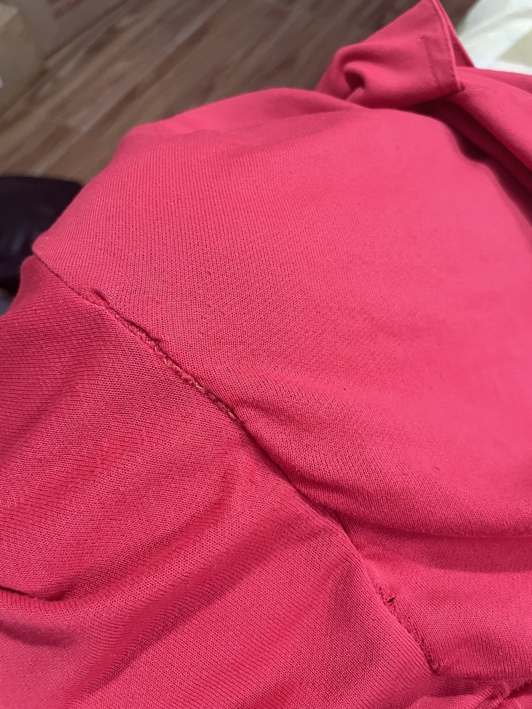

---
bluesky:
  id: bafyreidoadkn62zp4hv5j3kouzk7chraabkulyokaoqbgsllogjqnve42e
  url: 'at://did:plc:f4mmql45u3lfj6iltwjvtcdk/app.bsky.feed.post/3khnxlgfvrm2h'
  link: 'https://bsky.app/profile/did:plc:f4mmql45u3lfj6iltwjvtcdk/post/3khnxlgfvrm2h'
  handle: chiawase.bsky.social
  hostname: bsky.social
  did: 'did:plc:f4mmql45u3lfj6iltwjvtcdk'
date: 2023-12-29T13:34:10+0800
images:
  - https://cdn.uploads.micro.blog/113466/2023/c87542cbdc.jpg
mastodon:
  id: 111662076203996636
  username: chi
  hostname: social.lol
photos:
  - https://cdn.uploads.micro.blog/113466/2023/c87542cbdc.jpg
photos_with_metadata:
- url: https://cdn.uploads.micro.blog/113466/2023/c87542cbdc.jpg
  width: 450
  height: 600
url: /2023/12/29/chenen-halatang-tinahi.html
---

chenen! halatang tinahi, pero goal naman is mawala butas. solb 👍😂

