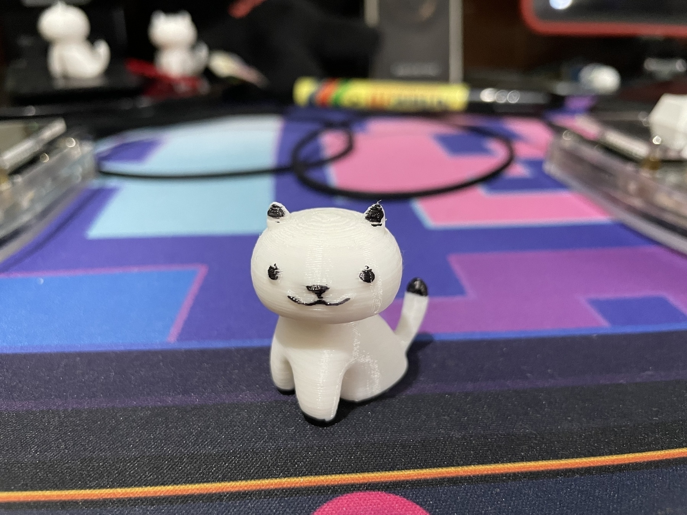

Sharing this 3d-printed neko atsume style cat printed by my boyfriend, and colored in (with markers) by me 😁

There are 3 more cats like this, and they just stay seated on my monitor's stand accompanying me 🐈

