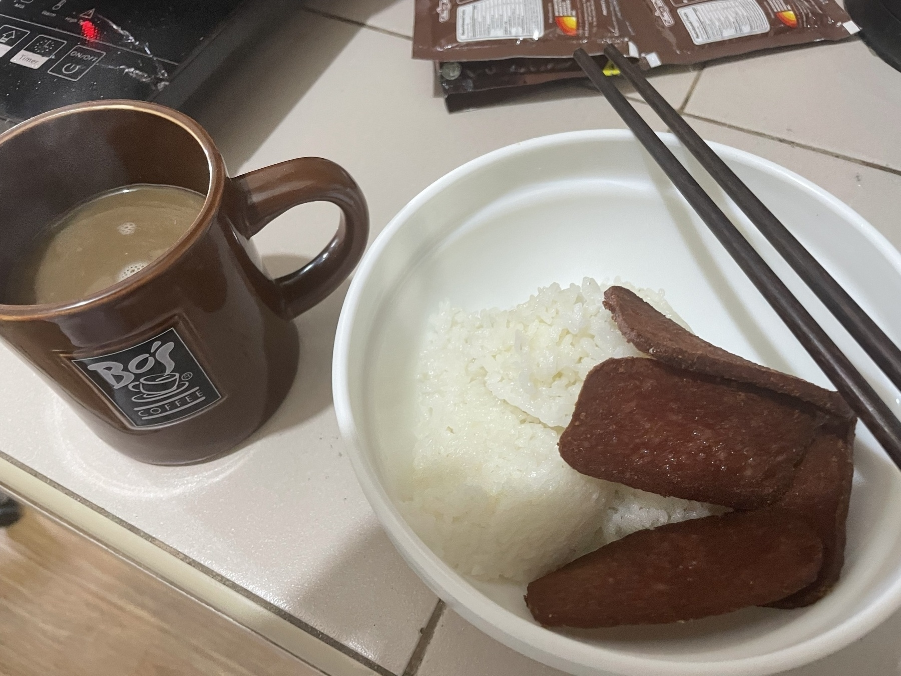

Food is apt for this prompt, I guess. Lately I've been (re)figuring out how I'd feed or sustain myself as I live alone. 

On good days, I do cook myself something, but admittedly I just do simple fried dishes. Trying to explore other... more cost-effective ways soon.

