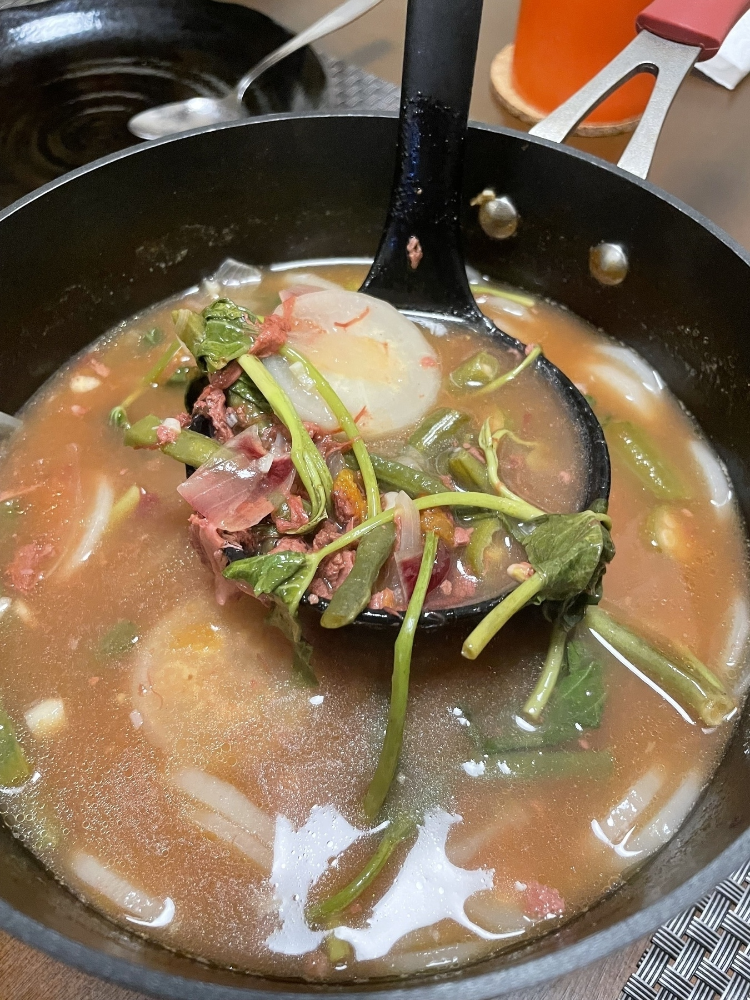

---
bluesky:
  id: bafyreigsoslyicp4l2y7xvtl5ya4fgvufim4hocic2yuo3urcv6jbyy6kq
  url: 'at://did:plc:f4mmql45u3lfj6iltwjvtcdk/app.bsky.feed.post/3lcd5ddufry27'
  link: 'https://bsky.app/profile/did:plc:f4mmql45u3lfj6iltwjvtcdk/post/3lcd5ddufry27'
  handle: chiawase.bsky.social
  hostname: bsky.social
  did: 'did:plc:f4mmql45u3lfj6iltwjvtcdk'
date: 2024-12-02T20:38:06+0800
images:
  - https://cdn.uploads.micro.blog/113466/2024/052bce81d1.jpg
mastodon:
  id: 113583265691408111
  username: chi
  hostname: social.lol
photos:
  - https://cdn.uploads.micro.blog/113466/2024/052bce81d1.jpg
photos_with_metadata:
- url: https://cdn.uploads.micro.blog/113466/2024/052bce81d1.jpg
  width: 450
  height: 600
threads:
  id: 17914934766018910
  url: https://www.threads.net/@_chiawase/post/DDE4W6itwFD
  username: _chiawase
---

Corned beef sinigang done! It tastes like sinigang, and the corned beef was yummy, added a subtle salty taste. My partner said we need to use 2 cans of corned beef next time so there's more of it haha (Yes, the kind for breakfast normally 😆) interesting meal hehe 10/10 would eat again

